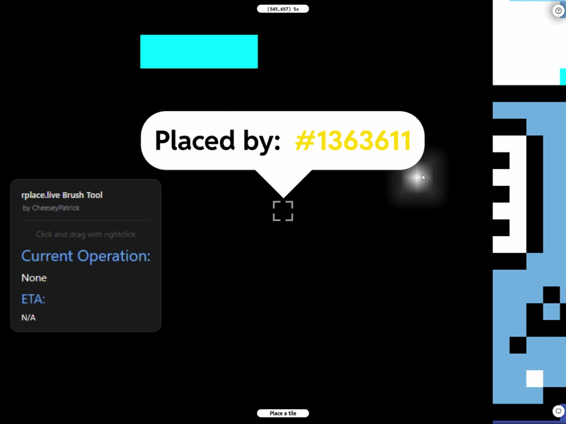

# r/place Brush

A Chrome extension that adds a brush tool to [rplace.live](https://rplace.live/). Fully working as of 3/29/26.



---

## How To Use

Once the extension is loaded and you are on [rplace.live](https://rplace.live/), select a color from the palette. Then, you can use the brush tool by holding down right click on your mouse.

---

## Loading the Extension in Chrome

This tool is provided as a Chrome extension for ease of use. It will function on any device that can run a browser that supports Chrome extensions.

1. **Download the latest release**

   Go to the [Releases](https://github.com/CheeseyPatrick/rplace-brush/releases) tab on GitHub and download the `v1.6.8.zip` file under **Assets**.

2. **Extract the ZIP**

   Unzip the downloaded file to your computer.

3. **Open Chrome and go to the Extensions page**

   Navigate to `chrome://extensions` in your address bar.

4. **Enable Developer Mode**

   Toggle the **Developer mode** switch in the top-right corner of the Extensions page.

5. **Load the unpacked extension**

   Click **Load unpacked**, then select the extracted `Rplace_Brush` folder.

6. **Confirm it's active**

   The extension should now appear in your extensions list and be enabled. You may need to refresh [rplace.live](https://rplace.live) if it was already open.

---

## Building the Extension Yourself

Since this tool is open source, you may choose to build it yourself or help contribute to the project.

1. **Install Node.js and npm**

   Download and install Node.js from [nodejs.org](https://nodejs.org). npm is included automatically.

2. **Install Git**

   Download and install Git from [git-scm.com](https://git-scm.com). During installation, the default options are fine.

3. **Clone the repository**

   Copy this git repository to your computer using:

```bash
   git clone https://github.com/CheeseyPatrick/rplace-brush.git
   cd rplace-brush
```

4. **Install dependencies**

```bash
   npm install
```

5. **Build the extension**

```bash
   npm run build
```

This compiles the source files. You can then find the finished extension inside of the `dist` folder.
